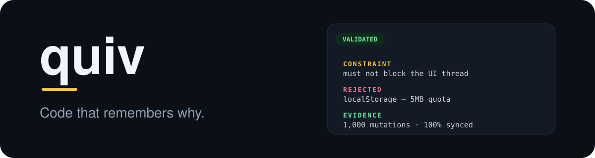
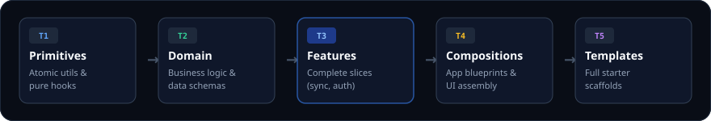

<p align="center">
  
</p>

<p align="center">
  <a href="https://github.com/chama-x/quiv/releases"></a>
  <a href="https://github.com/chama-x/quiv/actions"></a>
  <a href="https://opensource.org/licenses/MIT"></a>
</p>

<p align="center">
  <strong>quiv</strong> — your AI agents stop starting from scratch.<br>
  Every solution you keep becomes a versioned, proven pattern<br>
  your agents retrieve instead of re-invent.
</p>

---

## Every project starts at zero

You know this loop:

```text
You:          "Add offline sync with conflict resolution."

Agent:        writes it from scratch.
              picks localStorage for the queue —
              the exact thing you proved broken two projects ago.

You:          an hour of debugging. You re-explain the outbox
              design. It works. You ship.

Next project: same prompt. Same agent. Same from scratch.
              It picks localStorage again.
```

Your agents don't remember anything. Not the solutions you shipped,
not the failures you paid for, not the reasons the code is shaped
the way it is. Every session resets to zero.

---

## The same prompt, with quiv

```text
You:          "Add offline sync with conflict resolution."

Agent:        quiv find "offline sync conflict resolution"
              quiv read features/offline-sync

              → the design that already worked
              → the constraint that shaped it
              → the approach that already failed, and why

              quiv use features/offline-sync --project my-project
              → 7 files. Dependencies resolved. Registry updated.

              writes only what no pattern covers.
```

Two commands replace the hour. And the architecture is the one you
already proved works — *because* it's the one you already proved works.

---

## It compounds

Project 1, you build the pattern and contribute it back.  
Project 2, your agent retrieves it in two commands.  
Project 5, it's versioned, proven, and better than the day you wrote it.

When a pattern improves, `quiv check` flags every project that
should pull the upgrade. Iteration propagates instead of evaporating.

> **Your codebase compounds. Your agents stop resetting.**

---

## What the agent retrieves

This is `quiv read features/offline-sync` — the 312 tokens your
agent ingests instead of 15,000 tokens of raw source:

```text
offline-sync                                  VALIDATED  v1.2.0  312t

Problem     keep entities editable offline, without conflicts
Solution    durable outbox + backoff retry worker in IndexedDB

Constraint  must not block the UI thread during sync bursts
Rejected    localStorage queue — 5MB quota fails with attachments
Evidence    1,000 offline mutations, 100% synced on reconnect

Deps        hooks/useOfflineEntity · utils/conflictResolution
Files       7
Deeper      quiv read offline-sync --level full
```

The **Rejected** line is why your agent never picks localStorage.
It's the failure you already paid for, written down once, read forever.

When you contribute a pattern back, you record three lines —
constraint, rejected, evidence. That record is what your next agent
reads instead of guessing.

---

## Use it

Bun required — 30 seconds if you don't have it:

```bash
curl -fsSL https://bun.sh/install | bash
```

Install globally for instant `quiv` and `qv` commands anywhere:

```bash
bun install -g @quiv-knowledge/cli
# Or run on-demand with bunx / npx without installing:
# bunx @quiv-knowledge/cli init --agents --antigravity
```

Then, from anywhere (zero-config, auto-discovers global or local knowledge):

```bash
$ quiv list --tier features
```

```text
Total patterns: 32

[FEATURES] (6)
  • features/offline-sync [PROVEN|v2.0] - Full offline synchronization engine with durable outbox queue
  • features/intent-install-prompt [VALID|v1.0] - Defers PWA install prompt until high-intent user signals
  • features/github-star-engine [PROVEN|v1.0] - Complete 7-second README conversion funnel
  ...
```

```bash
$ quiv find "cinema storefront oled tokens"
```

```text
Found 22 matching pattern(s):

[Score: 405] compositions/app-styles/apple-native-pwa/components (VALIDATED)
  Match: name
  "Apple-native PWA storefront layout shell with parallel transitions, per-screen scroll..."

[Score: 175] compositions/app-styles/apple-native-pwa (VALIDATED)
  Match: synonym
  "...components/storefront-shell.tsx..."

[Score: 145] compositions/apple-native-pwa-shell (EXPERIMENTAL)
[Score: 585] compositions/oled-glass-tokens (EXPERIMENTAL)
```

```bash
$ quiv use compositions/app-styles/apple-native-pwa --dest ./src --project my-project
```

```text
=== Pattern: apple-native-pwa (compositions/app-styles/apple-native-pwa) ===
Status:  VALIDATED | Version: v1.0
Dependencies (2):
  • compositions/design-tokens (v1.0)
  • compositions/motion-patterns (v1.0)

✓ Scaffolded 24 file(s) into: ./src
✓ Recorded in registry for project: "my-project"
```

No Bun handy? [Open a Codespace](https://codespaces.new/chama-x/quiv) with everything preloaded.

---

## The knowledge model

<p align="center">
  
</p>

| Tier | Holds | Example |
| :--- | :--- | :--- |
| `primitives` | building blocks | `primitives/hooks/useOfflineEntity` |
| `domain` | business rules | `domain/erp/inventory-allocation` |
| `features` | turnkey capabilities | `features/offline-sync` |
| `compositions` | assembly guidelines | `compositions/app-styles/apple-native-pwa` |
| `templates` | project scaffolds | `templates/high-star-oss-repo` |

`use` pulls the entire dependency tree with it — a composition arrives standing on the design tokens, hooks, and motion primitives it actually needs.

Every pattern carries a status it has earned:

`EXPERIMENTAL → VALIDATED → PROVEN`

Status isn't a version. A version says the code changed. Status says the approach survived.

A registry tracks which projects consume which patterns, at which versions. When a pattern moves, `quiv check` flags drift immediately.

---

## Equip your agents & Antigravity (10-Second Setup)

```bash
bunx @quiv-knowledge/cli init --agents --antigravity
```

Installs:
- **Antigravity Native Skill**: `~/.gemini/config/skills/quiv/SKILL.md` (and `.agents/skills/quiv/SKILL.md`) for zero-prompt native agent activation.
- **Global & Project Rules**: `~/.gemini/config/rules/quiv.md`, `AGENTS.md`, and `.cursor/rules/quiv.mdc` for Cursor, Claude Code, and Copilot.
- **Global Config Fallback**: `~/.config/quiv/config.json` so every CLI invocation in any workspace succeeds with zero friction.

### Day-to-Day: Just talk to your Agent

From then on, you don't even have to type terminal commands. You converse naturally with Antigravity, Cursor, or Claude Code:

```text
You:    "Add offline sync with conflict resolution using QUIV."
Agent:  quiv find "offline sync" → quiv read → quiv use features/offline-sync
        Scaffolds 7 files with IndexedDB outbox. Writes project custom code.

You:    "Extract the gesture drawer we built into QUIV."
Agent:  quiv learn --from ./src/components/Drawer.tsx --tier compositions --name gesture-drawer \
          -m "feat: velocity gesture drawer" -c "touch-action: none" -r "react-spring" -e "60fps on iOS"
        Automatically packages the pattern and opens PR.
```

---

## Command reference

| Command | Does | Output budget |
| :--- | :--- | :--- |
| `quiv find "<query>" [--json]` | Deep semantic & code search by problem or keyword | ~ 500t |
| `quiv read <pattern> [-l overview\|full\|implementation]` | Read with progressive disclosure levels | 300–3,000t |
| `quiv use <pattern> [-d <dest>] [--flat] [-P <project>]` | Resolve deps, copy/scaffold files, update registry | ~ 200t |
| `quiv learn [options]` / `extract` | Harvest and distill components from projects into QUIV | ~ 300t |
| `quiv list [-t <tier>] [-f compact\|table\|json]` | Patterns by tier, domain, or capability | ≤ 800t |
| `quiv check [-P <project>]` | Flag outdated pattern versions in use | ~ 300t |
| `quiv status` | Quick health and inventory check | ~ 100t |
| `quiv contribute [options]` | Branch, Lore-lite commit, and open PR | — |
| `quiv init [--agents] [--antigravity]` | Bootstrap knowledge base, agent skills & rules | — |

**Global Options:** `-p, --path <path>`, `-r, --registry <path>`, `-f, --format <compact|table|json>`, `--json` can be passed to any command or at the top level (e.g. `quiv -p ./knowledge list`).

Budgets are design targets, not marketing: every command prints its actual
token count. Run one and check it.

---

## Post-Project Learning & Contributing

`quiv learn` (or `quiv contribute`) packages your code, formats the commit with Lore-lite trailers, and opens the PR.
The standard is three trailers:

```git
feat(offline-sync): add durable retry outbox

Durable outbox queue with exponential-backoff retry worker in IndexedDB.

Constraint: must not block the UI thread during heavy sync bursts
Rejected: localStorage queue | 5MB quota was insufficient for attachments
Evidence: tested with 1,000 offline mutations, 100% synced on reconnect
```

That's the whole format. It's what stops the next agent from re-litigating a
settled decision.

---

## Community

- [good-first-issues](https://github.com/chama-x/quiv/issues?q=is%3Aissue+is%3Aopen+label%3A%22good+first+issue%22) — the on-ramp.
- [Discord](https://discord.gg/quiv) — where patterns get argued into `PROVEN`.

---

## License

MIT — see [LICENSE](LICENSE).
