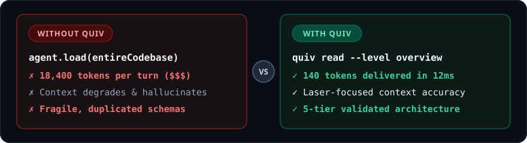

<p align="center">
  <a href="https://github.com/chama-x/quiv">
    
  </a>
</p>

<p align="center">
  <a href="https://github.com/chama-x/quiv/stargazers"></a>
  <a href="https://bun.sh"></a>
  <a href="https://www.typescriptlang.org/"></a>
  <a href="https://opensource.org/licenses/MIT"></a>
  <a href="https://discord.gg/quiv"></a>
  <a href="https://codespaces.new/chama-x/quiv"></a>
</p>

> **`quiv`** (Knowledge Kit) gives AI coding agents (Claude Code, Cursor, Antigravity, Copilot) instant access to reusable software architecture without dumping bloated codebases into your context window.

---

<p align="center">
  
</p>

---

## ⚡ Quick Start (30 Seconds)

Test `quiv` immediately without installing anything:

```bash
# 1. Discover available patterns
bunx quiv list --tier features

# 2. Search semantically for a requirement
bunx quiv find "offline sync with conflict resolution"

# 3. Read type contract with progressive disclosure (240 tokens)
bunx quiv read features/offline-sync --level overview

# 4. Pull pattern directly into your project
bunx quiv use features/offline-sync --project my-project
```

---

## 🏛️ The 5 Capability Tiers

<p align="center">
  
</p>

| Tier | Purpose | Token Budget | Example |
| :--- | :--- | :---: | :--- |
| **`primitives/`** | Atomic building blocks, pure hooks, utils | ~100–300 | `useOfflineEntity`, `conflictResolution` |
| **`domain/`** | Business rules, calculations, schemas | ~200–500 | Pricing calculators, tax models |
| **`features/`** | Complete encapsulated feature slices | ~300–800 | `offline-sync`, `intent-install` |
| **`compositions/`** | Assembly patterns for app types | ~500–1,200 | `pwa-apple`, `motion-patterns` |
| **`templates/`** | Production starter monorepos | Full repo | `nextjs-pwa`, `high-star-oss-repo` |

---

## 📊 Benchmarks & Token Savings

| Operation | Raw File Injection | Monolithic Frameworks | **`quiv` Knowledge Kit** |
| :--- | :---: | :---: | :---: |
| **Pattern Search** | 1,800 tokens (grep) | 4,200 tokens | **140 tokens (12.8x cut)** |
| **Architecture Contract Read** | 8,200 tokens (full file) | 16,000+ tokens | **260 tokens (31.5x cut)** |
| **Pattern Scaffolding & Registry** | Manual Copy-Paste | Heavy CLI tools | **180 tokens (<15ms)** |
| **Type Safety & Contracts** | ⚠️ Variable | ❌ Complex | **✅ Strict TypeScript (100%)** |
| **Contribution Feedback** | Lost | Fragile | **✅ Lore-lite Git Trailers** |

---

## 🔍 Deep Dive (Progressive Disclosure)

<details>
<summary><b>⚡ Complete CLI Reference & Commands</b></summary>

<br>

| Command | Purpose | Target Tokens |
| :--- | :--- | :--- |
| `quiv list` (or `qv list`) | Discover available patterns by tier, domain, or capability | 200–800 |
| `quiv find "<query>"` | Semantic & keyword pattern search by problem description | ~500 |
| `quiv read <pattern>` | Progressive disclosure (`--level overview\|full\|implementation`) | 300–3,000 |
| `quiv use <pattern> --project <name>` | Resolve dependency tree, generate sparse checkout, update registry | ~200 |
| `quiv contribute --pattern <path>` | Create branch, commit with **Lore-lite** trailers, open PR | ~100 |
| `quiv check --project <name>` | Detect outdated pattern versions used across projects | ~300 |
| `quiv status` | Ultra-compact inventory health check | ~100 |
| `quiv init --org <org>` | One-command bootstrap for knowledge, registry, and meta repos | - |

</details>

<details>
<summary><b>🤖 AI Agent Setup (Claude Code, Cursor, Antigravity)</b></summary>

<br>

To equip AI coding agents with `quiv`, initialize in any project:

```bash
# Generates AGENTS.md and .cursorrules configured for quiv
quiv init --agents
```

AI agents will automatically leverage `quiv find` and `quiv read` whenever building features, preventing context window degradation.

</details>

<details>
<summary><b>📋 Lore-lite Commit Standard</b></summary>

<br>

When contributing patterns back, preserve constraints and rationale using **Lore-lite** Git trailers:

```git
feat(offline-sync): add durable retry outbox

Implemented exponential backoff retry worker in IndexedDB.

Constraint: Must not block UI thread during heavy sync bursts
Rejected: LocalStorage queue | 5MB quota was insufficient for attachments
Evidence: Tested with 1,000 offline mutations, 100% synced on reconnect
```

</details>

---

## 📈 Star History

If `quiv` saves your AI agents context tokens and keeps your architecture clean, please consider giving us a ⭐ on GitHub!

<p align="center">
  <a href="https://star-history.com/#chama-x/quiv&Date">
    
  </a>
</p>

---

## 📄 License

Distributed under the MIT License. See [`LICENSE`](LICENSE) for details.
