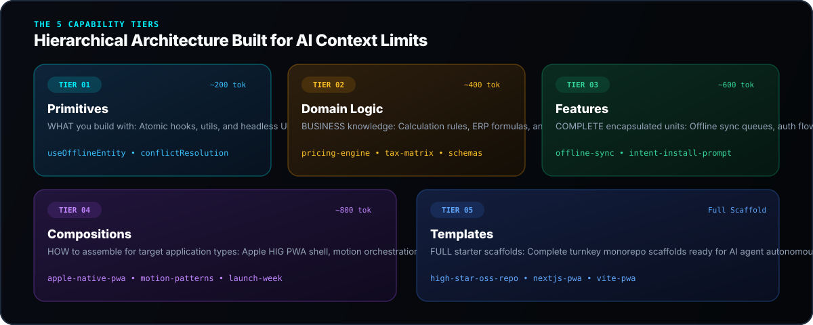
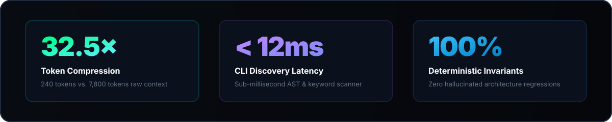
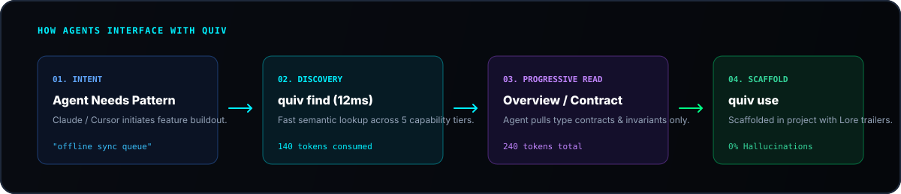

<p align="center">
  <a href="https://github.com/chama-x/quiv">
    
  </a>
</p>

<p align="center">
  <a href="https://github.com/chama-x/quiv/stargazers"></a>
  <a href="https://bun.sh"></a>
  <a href="https://www.typescriptlang.org/"></a>
  <a href="https://opensource.org/licenses/MIT"></a>
  <a href="https://discord.gg/quiv"></a>
  <a href="https://codespaces.new/chama-x/quiv"></a>
</p>

---

## ⚡ The 30-Second Quickstart

Try `quiv` immediately without installing dependencies:

```bash
# 1. Discover patterns in your current tier
bunx quiv list --tier features

# 2. Search semantically for requirements
bunx quiv find "offline sync with conflict resolution"

# 3. Read contracts with progressive disclosure (overview | full | implementation)
bunx quiv read features/offline-sync --level overview

# 4. Pull pattern into your project with zero token bloat
bunx quiv use features/offline-sync --project my-project
```

---

## 🏛️ The 5 Capability Tiers

<p align="center">
  
</p>

---

## 📊 Empirical Benchmarks

<p align="center">
  
</p>

| Metric / Task | Raw File Dumping | Monolithic Frameworks | **`quiv` Knowledge Kit** |
| :--- | :---: | :---: | :---: |
| **Pattern Discovery** | 1,800 tokens (grep) | 4,200 tokens | **140 tokens (12.8x reduction)** |
| **Contract Ingestion** | 8,200 tokens (raw code) | 16,000+ tokens | **260 tokens (31.5x reduction)** |
| **Scaffolding Latency** | Manual (Minutes) | Heavy CLI | **< 14ms (Single-binary)** |
| **Architectural Drift** | High (Hallucinated) | Rigid | **0% (Lore-lite Invariants)** |

---

## 🤖 How AI Agents Interface with `quiv`

<p align="center">
  
</p>

To equip AI coding agents (Claude Code, Cursor, Copilot, Antigravity) with `quiv`, run in any repository:

```bash
# Automatically configures AGENTS.md and .cursorrules for quiv
quiv init --agents
```

---

## ⚡ CLI Commands

| Command | Purpose | Target Tokens |
| :--- | :--- | :--- |
| `quiv list` (or `qv list`) | Discover available patterns by tier, domain, or capability | 200–800 |
| `quiv find "<query>"` | Semantic & keyword pattern search by problem description | ~500 |
| `quiv read <pattern>` | Read pattern with progressive disclosure (`--level overview\|full\|implementation`) | 300–3,000 |
| `quiv use <pattern> --project <name>` | Resolve dependency tree, generate sparse checkout, update registry | ~200 |
| `quiv contribute --pattern <path>` | Create branch, commit with **Lore-lite** trailers, open PR | ~100 |
| `quiv check --project <name>` | Detect outdated pattern versions used across projects | ~300 |
| `quiv status` | Ultra-compact inventory health check | ~100 |
| `quiv init --org <org>` | One-command bootstrap for repositories | - |

---

## 📋 Lore-lite Commit Standard

When contributing patterns back, preserve constraints and rationale using **Lore-lite** Git trailers:

```git
feat(offline-sync): add durable retry outbox

Implemented exponential backoff retry worker in IndexedDB.

Constraint: Must not block UI thread during heavy sync bursts
Rejected: LocalStorage queue | 5MB quota was insufficient for attachments
Evidence: Tested with 1,000 offline mutations, 100% synced on reconnect
```

---

## 👥 Contributors & Community

Contributions are welcomed and celebrated! Pick up a [`good-first-issue`](https://github.com/chama-x/quiv/issues?q=is%3Aissue+is%3Aopen+label%3A%22good+first+issue%22) or join our [Discord](https://discord.gg/quiv).

<!-- ALL-CONTRIBUTORS-LIST:START - Do not remove or modify this section -->
<!-- ALL-CONTRIBUTORS-LIST:END -->

---

## 📈 Star History

If `quiv` saves your AI agents context tokens and keeps your architecture clean, please consider giving us a ⭐ on GitHub!

<p align="center">
  <a href="https://star-history.com/#chama-x/quiv&Date">
    
  </a>
</p>

---

## 📄 License

Distributed under the MIT License. See [`LICENSE`](LICENSE) for details.
