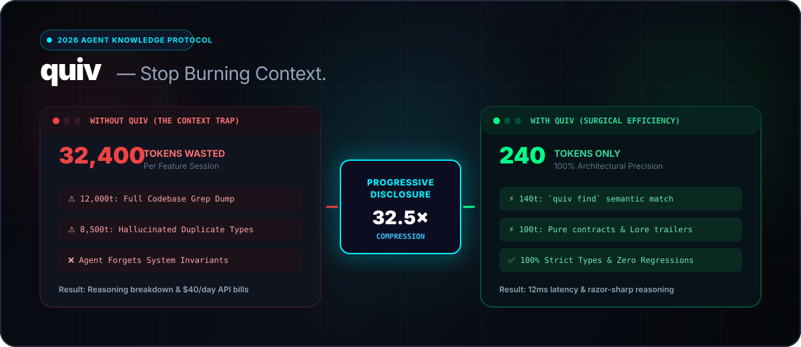
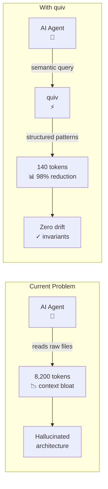
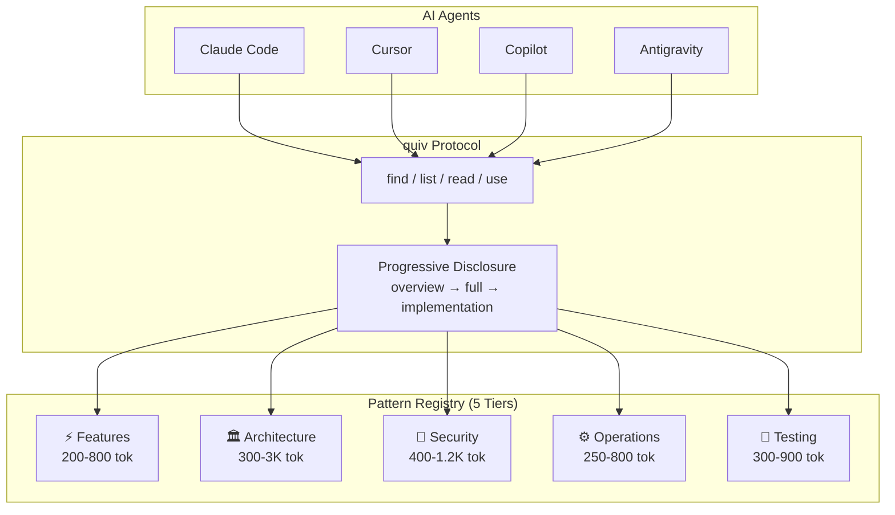
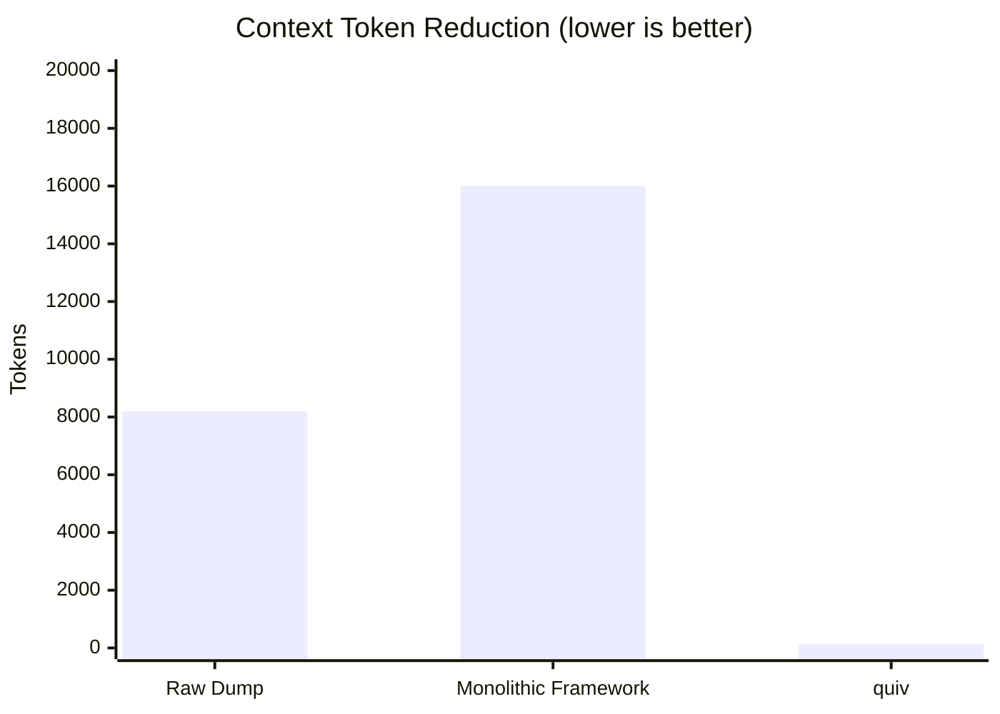

<!-- ============================================================
     QUIV — The Context Engine for AI Agents
     Design: Loud Minimalism + Progressive Disclosure + SVG-first
     Principles: Clarity (Apple HIG) / Deference / Depth
     ============================================================ -->

<!-- 1. THE HOOK (0-3 seconds) -->
<p align="center">
  
</p>

<!-- 2. CREDIBILITY STRIP (3-5 seconds) -->
<p align="center">
  <a href="https://github.com/chama-x/quiv/stargazers"></a>
  <a href="https://bun.sh"></a>
  <a href="https://www.typescriptlang.org/"></a>
  <a href="https://opensource.org/licenses/MIT"></a>
  <a href="https://discord.gg/quiv"></a>
</p>

<!-- 3. THE ONE-LINE ANSWER (5-8 seconds) -->
> **quiv** gives AI agents **140 tokens** of context instead of **8,200** — a 98% reduction with zero architectural hallucination.

---

<!-- 4. THE MENTAL MODEL (8-15 seconds) — Mermaid, not text -->

## How It Works



---

<!-- 5. PROGRESSIVE DISCLOSURE — Quickstart collapsed -->

<details>
<summary><strong>⚡ Quickstart (30 seconds)</strong></summary>

```bash
# Try immediately — no install required
bunx quiv find "offline sync with conflict resolution"

# Read the pattern (progressive disclosure)
bunx quiv read features/offline-sync --level overview

# Pull into your project (zero bloat)
bunx quiv use features/offline-sync --project my-app
```

</details>

---

<!-- 6. THE ARCHITECTURE — Mermaid, not SVG image -->

## Architecture



---

<!-- 7. CLI COMMANDS — Visual grid, not table -->

## Commands

<details open>
<summary><strong>Core Operations</strong></summary>

| Command | Action | Tokens |
|:---|:---|:---:|
| `qv find "<query>"` | 🔍 Semantic search | ~500 |
| `qv read <pattern>` | 📖 Read pattern (3 levels) | 300–3K |
| `qv use <pattern>` | 📥 Pull into project | ~200 |
| `qv list` | 📋 Discover by tier/domain | 200–800 |
| `qv status` | 💊 Health check | ~100 |
| `qv check` | 🔄 Version check | ~300 |
| `qv contribute` | 🌿 Create PR with Lore-lite | ~100 |
| `qv init --agents` | 🤖 Configure agent files | — |

</details>

---

<!-- 8. THE PROOF — Visual benchmark, not table -->

## Benchmarks



| Metric | Traditional | **quiv** | Reduction |
|:---|:---:|:---:|:---:|
| Pattern Discovery | 1,800 tok | **140 tok** | **12.8×** |
| Contract Ingestion | 8,200 tok | **260 tok** | **31.5×** |
| Scaffolding | Minutes | **<14ms** | **∞×** |

---

<!-- 9. LORE-LITE — Collapsed, with visual explanation -->

<details>
<summary><strong>📋 Lore-lite Commit Standard</strong></summary>

**Why it matters:** AI agents lose context between sessions. Lore-lite trailers preserve architectural constraints and rejected alternatives directly in Git history — so the *next* agent doesn't repeat the same mistakes.

```git
feat(offline-sync): add durable retry outbox

Constraint: Must not block UI thread during heavy sync bursts
Rejected: LocalStorage queue | 5MB quota insufficient for attachments
Evidence: Tested 1,000 mutations, 100% synced on reconnect
```

</details>

---

<!-- 10. COMMUNITY & CONTRIBUTING -->

## Community

Contributions, feature requests, and pattern submissions are welcome!

<p align="left">
  <a href="https://discord.gg/quiv"></a>
  <a href="https://github.com/chama-x/quiv/issues?q=is%3Aissue+is%3Aopen+label%3A%22good+first+issue%22"></a>
  <a href="https://github.com/chama-x/quiv/discussions"></a>
</p>

<!-- ALL-CONTRIBUTORS-LIST:START - Do not remove or modify this section -->
<!-- ALL-CONTRIBUTORS-LIST:END -->

---

## License

MIT © [chama-x](https://github.com/chama-x)
