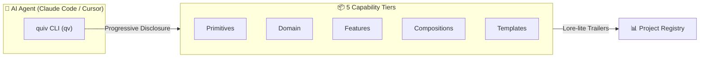

# 🎨 Visual Assets, Badges & Terminal Demo Engineering

> **The definitive guide to crafting award-winning visual assets: dark-mode native SVG banners, high-contrast terminal recordings, and elegant badge typography that elevate repository perceived quality.**

---

## 1. Dark Mode / Light Mode Theme Switching in GitHub READMEs

GitHub renders markdown across dark and light themes. Modern repositories leverage GitHub's native theme fragment identifiers (`#gh-dark-mode-only` and `#gh-light-mode-only`) or HTML `<picture>` elements to guarantee perfect contrast on all devices.

### Pattern A: Image Fragment Syntax (Recommended)
```markdown
<p align="center">
  <a href="https://github.com/quiv-knowledge/quiv">
    
    
  </a>
</p>
```

### Pattern B: The `<picture>` Tag Syntax
```html
<picture>
  <source media="(prefers-color-scheme: dark)" srcset="assets/banner-dark.svg">
  <source media="(prefers-color-scheme: light)" srcset="assets/banner-light.svg">
  
</picture>
```

---

## 2. Terminal Recording Standards: Charmbracelet VHS Automation

Static screenshots are passive; animated terminal recordings demonstrate interactive reality. The gold standard for generating crisp, reproducible CLI demos is **Charmbracelet VHS**.

### The `.tape` Automation Script (`demo.tape`)
Create a reproducible `.tape` file in your repository:

```vhs
# Output configuration
Output assets/demo.gif
Output assets/demo.webm

Set FontSize 18
Set FontFamily "JetBrains Mono"
Set LetterSpacing 0
Set LineHeight 1.4
Set Theme "Catppuccin Mocha"
Set Width 900
Set Height 480
Set Padding 20
Set Framerate 60

# Recorded CLI sequence
Sleep 500ms
Type "bunx quiv find 'offline sync with sqlite'"
Sleep 300ms
Enter
Sleep 1.5s

Type "bunx quiv read features/offline-sync --level overview"
Sleep 300ms
Enter
Sleep 2s

Type "bunx quiv use features/offline-sync --project erp-app"
Sleep 300ms
Enter
Sleep 2.5s
```

### Rendering Command
```bash
# Render crisp 60fps GIF and WebM assets with zero manual screen recording
vhs demo.tape
```

> [!TIP]
> Keep the generated GIF under **3.5MB** to ensure instant loading on mobile connections. Using 480p height and Catppuccin Mocha / Tokyo Night themes gives maximum visual contrast while keeping the file size ultralight.

---

## 3. Shields.io Badge Engineering & Styling Rules

Badges communicate production readiness, security, and ecosystem health. Avoid chaotic color palettes by standardizing on a clean, unified badge design.

### The Standard Badge Style: `style=flat-square` or `style=for-the-badge`

```markdown
<p align="center">
  <a href="https://github.com/quiv-knowledge/quiv/stargazers"></a>
  <a href="https://bun.sh"></a>
  <a href="https://www.typescriptlang.org/"></a>
  <a href="https://opensource.org/licenses/MIT"></a>
  <a href="https://discord.gg/quiv"></a>
</p>
```

### Color Palette Guidelines
- **Runtime / Primary Tool**: `#000000` (Black) or `#3178C6` (TypeScript Blue)
- **Status / Health / CI**: `#22c55e` (Emerald Green)
- **Community / Discord**: `#5865F2` (Discord Blurple)
- **Token Efficiency / Stats**: `#8b5cf6` (Purple / AI accent)

---

## 4. Architectural Visuals: ASCII Box Art vs. Mermaid vs. SVG

For architecture diagrams:

### When to Use Mermaid
Use Mermaid for interactive, rendered flowcharts that GitHub renders natively:


### When to Use ASCII Art
ASCII art is robust, zero-latency, renders instantly on every terminal, and never breaks across dark/light themes:
```
knowledge/
├── primitives/     ← Pure utils, hooks, headless UI
├── domain/         ← Business rules, calculations, schemas
├── features/       ← Reusable complete features (offline sync, auth)
├── compositions/   ← Assembly patterns for app types
└── templates/      ← Full project starter scaffolds
```
